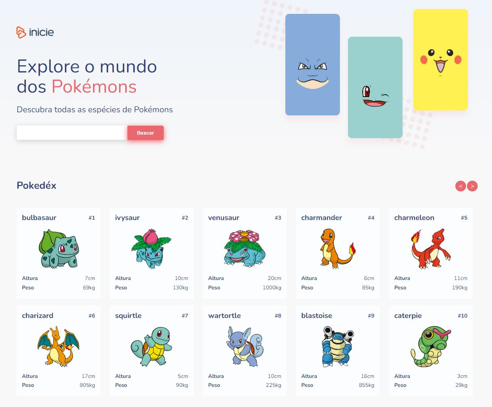
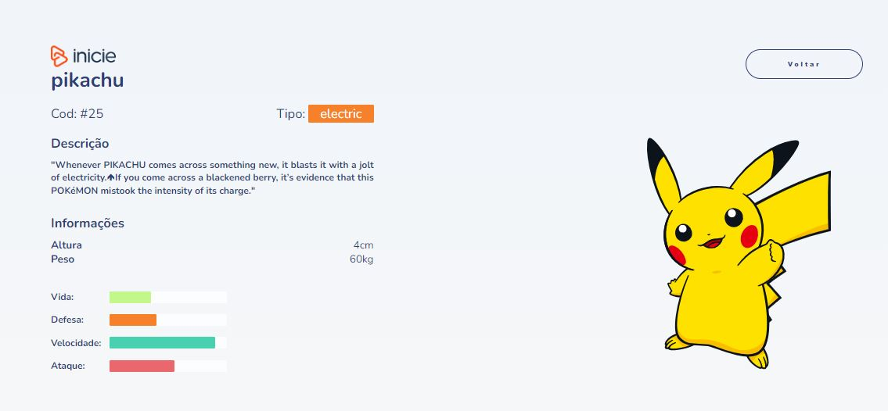

# Projeto App Pokemon

  
   

## 💻 Versão online

---

<a href="https://pokemon-emarra.vercel.app/" target="_blank">Versão online</a>

Layout disponibilizado através do processo seletivo "INICIE TRANSFORMAÇÃO EDUCACIONAL".

## 💻 Sobre o projeto

---

Projeto criado para processo seletivo Angular.

Objetivo: * utilizar api de pokemons <a href="https://pokeapi.co/" target="_blank">PokeApi</a>

## Instruções

---
## Rodando localmente

* ### Frontend

1. Navegar até a pasta naped
2. Instalar todos os pacotes com `yarn install` ou `npm install`
3. Executar o comando `yarn start` ou `npm run start`
4. Em alguns seguntos a URL: `http://localhost:4200/` ficará disponível
